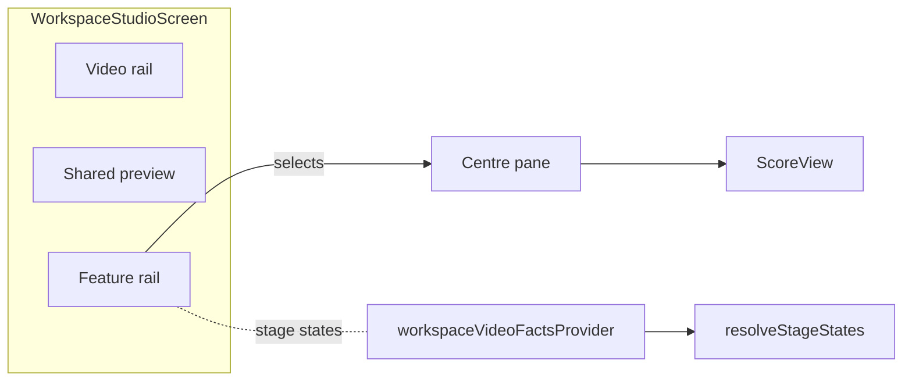
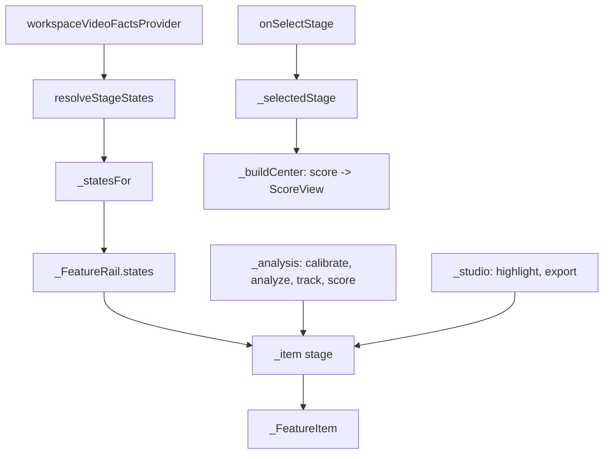

# Architecture — Move Review & score from Studio to Analysis

## Context

The workspace studio (`WorkspaceStudioScreen`) is a three-pane screen: a video
rail, one shared preview, and a right-hand **feature rail**. The feature rail is
the only thing this intent changes. It is a `ListView` composed of a **Play**
row, a **Analysis** group, and a **Studio** group, where the groups are two
private static lists of `PipelineStage` values.

No external system, storage, engine, or bridge participates.

## Options considered

| Option | Shape | Trade-off | Verdict |
| --- | --- | --- | --- |
| **A. Move between the existing lists** | `PipelineStage.score` leaves `_studio`, joins `_analysis`. | Two-line diff, zero new surface. Grouping stays hard-coded, which is already the status quo. | **Chosen** |
| B. Data-driven section model | Replace both lists with `const List<({String header, List<PipelineStage> stages})>`. | Declares grouping once and scales to more groups, but adds a record/model, changes the render loop, and rewrites tests/docs for no behaviour gain at two groups. | Rejected — YAGNI |
| C. Flat list with derived headers | Iterate `PipelineStage.values` and emit headers inline. | Loses the **Play** pseudo-row and the deliberate read-then-shape split; changes visual hierarchy beyond the request. | Rejected |
| D. Duplicate the item in both groups | Show Review & score under Analysis and Studio. | Ambiguous selected state (two rows claim `PipelineStage.score`), duplicates the busy spinner. | Rejected |

## Chosen architecture

Presentation-only regrouping inside a single widget. The stage graph, data
ownership, routes, and persistence are unchanged.

### Components

| Component | Responsibility | Inputs | Outputs |
| --- | --- | --- | --- |
| `_FeatureRail` | Render the feature lens list, grouped and ordered. Owns the two group constants. | `states`, `selectedStage`, `busyStages`, callbacks | Tiles, headers |
| `_analysis` / `_studio` | Membership and order of each group. | — (compile-time) | Ordered `PipelineStage` lists |
| `_item` / `_FeatureItem` | Render one rail row with done/busy/selected styling. | stage, state, busy flag | Row |
| `_buildCenter` | Map `_selectedStage` to the centre-pane view. | selected stage, match, controller | `ScoreView` etc. |
| `resolveStageStates` | Derive done/ready/idle from video facts. | `VideoStageFacts` | state map |

### Data flow

`workspaceVideoFactsProvider` → `resolveStageStates` → `_statesFor` →
`_FeatureRail.states` → `_item` styling. The move does not touch this path; only
which group iterates the `score` stage changes. Selecting the row still calls
`onSelectStage(PipelineStage.score)`, and `_buildCenter` still maps
`PipelineStage.score` to `ScoreView(match, controller)`.

### Failure modes

| Failure | Cause | Effect | Handling |
| --- | --- | --- | --- |
| Ordering regresses | A later edit puts score back in `_studio`. | Requested grouping lost. | Optional ordering widget test; doc is the reference. |
| Duplicate `score` row | Accidentally left in both lists. | Two selected rows, two spinners. | Single-source rule: each stage appears in exactly one list; reviewed at code review. |
| Stale done/busy state | Unrelated to the move — the state map is derived. | — | Existing `_refresh()` listeners unchanged. |
| Doc drift | `architecture.md` not updated. | Stale design record. | RS-8 makes it part of the change. |

## Security review (advisory)

Reviewer: `security-agent`.

- **Trust boundaries:** none added. The change is a compile-time list membership
  in a UI widget. No new input, parsing, I/O, IPC, network, or persistence.
- **Secrets / logging:** none touched.
- **Dependencies / supply chain:** none added.
- **Findings:** none. No blocking issues, no hardening items, no accepted risks
  to record.

## Boundaries

`_FeatureRail` owns the grouping and ordering only. `resolveStageStates` owns
stage readiness. `_buildCenter` owns the stage → view mapping. This change stays
entirely inside the first.
